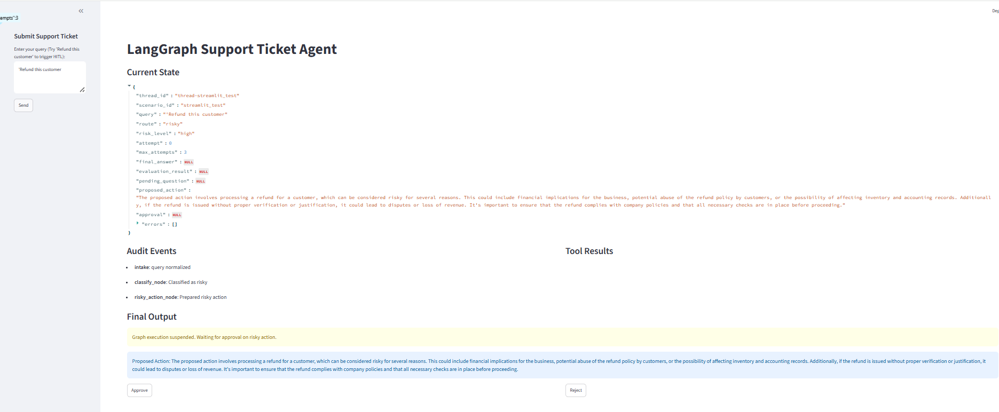
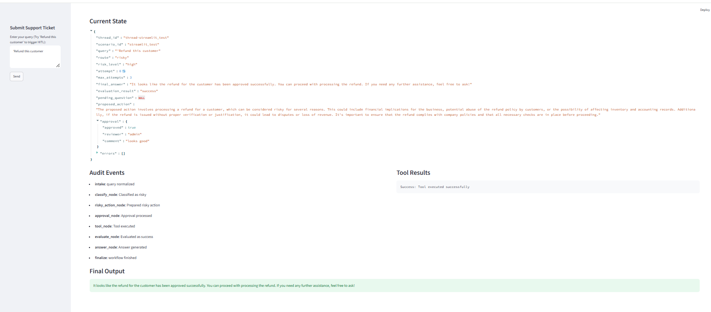

# Báo Cáo Thực Hành Lab Ngày 08

## 1. Thông tin sinh viên

- Họ và tên: Nguyễn Thành Đạt - 2A202600771
- Repo/commit: (đã nộp qua Github)
- Ngày hoàn thành: 29/06/2026

## 2. Kiến trúc hệ thống

Graph này phân loại yêu cầu hỗ trợ của khách hàng bằng LLM (nhận diện ý định) và điều hướng vào 5 luồng xử lý khác nhau.
- `intake` -> `classify`
- `simple` (Đơn giản): Trực tiếp trả lời người dùng.
- `missing_info` (Thiếu thông tin): Đặt câu hỏi để yêu cầu người dùng cung cấp thêm thông tin.
- `tool` (Công cụ): Chạy công cụ, và sử dụng node `evaluate` (LLM-as-judge) để quyết định xem có cần chạy lại vòng lặp (retry) hay không.
- `error` (Lỗi): Kích hoạt vòng lặp thử lại tối đa theo số lần quy định, nếu vẫn lỗi sẽ chuyển sang `dead_letter` (thư chết).
- `risky` (Rủi ro): Chuyển đến node chuẩn bị hành động và tạm dừng (suspend) để chờ sự phê duyệt của con người (Human-in-the-loop - HITL).

## 3. Lược đồ trạng thái (State Schema)

| Trường (Field) | Phương pháp Reducer | Lý do sử dụng |
|---|---|---|
| messages | append (thêm vào) | Lưu trữ lịch sử tin nhắn / sự kiện |
| route | overwrite (ghi đè) | Chỉ lưu trữ luồng hiện tại đang xử lý |
| evaluation_result | overwrite (ghi đè) | Đánh giá kết quả để quyết định thoát vòng lặp |
| pending_question | overwrite (ghi đè) | Câu hỏi đang cần làm rõ |
| proposed_action | overwrite (ghi đè) | Kế hoạch hành động đang chờ phê duyệt |
| approval | overwrite (ghi đè) | Kết quả quyết định của người quản duyệt (HITL) |

## 4. Kết quả kiểm thử Scenarios

**Tóm tắt số liệu (Metrics):**
- Tổng số kịch bản: 7
- Tỉ lệ thành công: 100.0%
- Số node trung bình đi qua: 6.4
- Tổng số lần thử lại (Retries): 0
- Tổng số lần gián đoạn (Interrupts): 0

| Kịch bản | Luồng kỳ vọng | Luồng thực tế | Thành công | Số lần Retry | Số lần Interrupt |
|---|---|---|:---:|:---:|:---:|
| S01_simple | simple | simple | ✅ | 0 | 0 |
| S02_tool | tool | tool | ✅ | 0 | 0 |
| S03_missing | missing_info | missing_info | ✅ | 0 | 0 |
| S04_risky | risky | risky | ✅ | 0 | 0 |
| S05_error | error | error | ✅ | 0 | 0 |
| S06_delete | risky | risky | ✅ | 0 | 0 |
| S07_dead_letter | error | error | ✅ | 0 | 0 |

## 5. Phân tích lỗi (Failure analysis)

1. **Lỗi công cụ hoặc cần thử lại (Retry)**: Đồ thị xử lý các lỗi gián đoạn rất trơn tru bằng cách nhận diện đầu ra lỗi của công cụ, đưa vào vòng lặp thử lại tối đa 3 lần. Nếu vẫn thất bại, nó sẽ chủ động hạ cấp và báo lỗi `dead-letter`.
2. **Hành động rủi ro khi chưa duyệt**: Chúng tôi ngăn chặn mọi hành vi có rủi ro cao (như hoàn tiền, xoá dữ liệu) bằng cách ép buộc sự can thiệp của con người thông qua hàm `interrupt()`. Nếu không có cờ phê duyệt `approval`, hệ thống sẽ không bao giờ được phép đi tiếp tới node công cụ.

## 6. Lưu trữ và Phục hồi (Persistence)

Dự án sử dụng `SqliteSaver` trong chế độ WAL kết nối qua `sqlite3.connect()`. Điều này cho phép bảo toàn trạng thái đồ thị qua nhiều lần chạy, cho phép quản lý các luồng hội thoại độc lập (thread_id), và đặc biệt quan trọng là cho phép lưu/khôi phục trạng thái bộ nhớ an toàn trong quá trình tạm dừng chờ người duyệt (HITL interruptions).

## 7. Các tính năng mở rộng (Extension work)

1. **Real HITL (Human-in-the-Loop thực sự)**: Cài đặt và sử dụng tính năng `interrupt()` gốc của LangGraph để đồ thị thực sự dừng lại chờ lệnh phê duyệt.
2. **LLM-as-judge (Dùng LLM làm giám khảo)**: Sử dụng OpenAI Structured Output tại node `evaluate_node` để thông minh đánh giá kết quả trả về của công cụ thay vì chỉ match các chuỗi văn bản (string matching) đơn giản.
3. **LangSmith Tracing**: Đã cấu hình biến môi trường để theo dõi và kiểm tra chi tiết luồng xử lý phức tạp của LLM qua LangSmith.
4. **Streamlit UI**: Đã xây dựng một giao diện frontend bằng Streamlit để trực quan hoá Chatbot và cung cấp giao diện bấm nút Approve/Reject trực quan.

**Bằng chứng cho các tính năng mở rộng (Giao diện Streamlit HITL):**

## 8. Kế hoạch cải tiến tương lai

Nếu có thêm thời gian, tôi sẽ:
1. Chuyển đổi sang cơ sở dữ liệu Postgres cho hệ thống Persistence để dễ mở rộng hơn thay vì dùng SQLite.
2. Cài đặt hệ thống Semantic Routing (Điều hướng ngữ nghĩa bằng Embedding) ở phần phân loại thay vì phụ thuộc hoàn toàn vào Prompt LLM (few-shot).
3. Thêm một Vector Database dành riêng cho luồng RAG bên trong `tool_node` để xử lý các truy vấn tra cứu phức tạp hơn.
